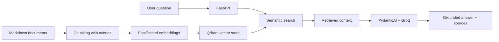

# Internal Knowledge Copilot

A grounded Retrieval-Augmented Generation (RAG) API for answering internal company-policy questions from Markdown documents.

The service retrieves relevant document chunks from a local Qdrant vector store and uses an LLM only to formulate an answer based on that retrieved context.

## Features

- Markdown document ingestion and word-based chunking with overlap
- Semantic search with FastEmbed and Qdrant
- Grounded RAG answers powered by PydanticAI and Groq
- Source validation: the model can cite only retrieved filenames
- Clear fallback for questions not covered by the knowledge base
- FastAPI and interactive OpenAPI documentation
- Structured JSON request logs with correlation IDs and latency
- Unit tests with pytest
- End-to-end RAG evaluation cases
- Docker containerization with persistent local vector storage
- GitHub Actions CI for tests and Docker image builds

## Architecture



## Tech Stack

- Python 3.14
- FastAPI and Pydantic
- Qdrant local mode
- FastEmbed with `BAAI/bge-small-en`
- PydanticAI
- Groq API with `qwen/qwen3.8-27b`
- pytest
- Docker and GitHub Actions

## Quick Start with Docker

### 1. Clone the repository

```powershell
git clone https://github.com/Mykhailo-Surovtsev/Internal_Knowledge_Copilot.git
cd Internal_Knowledge_Copilot
```

### 2. Configure the API key

Create a `.env` file in the project root:

```text
GROQ_API_KEY=your_groq_api_key_here
```

Never commit `.env`. Use `.env.example` only as a template.

### 3. Build the image

```powershell
docker build --tag internal-knowledge-copilot:0.3.0 .
```

### 4. Run the container

```powershell
New-Item -ItemType Directory -Force storage

$projectPath = (Get-Location).Path

docker run --rm --name internal-knowledge-copilot --env-file .env --publish 127.0.0.1:8001:8001 --mount "type=bind,source=$projectPath\storage,target=/app/storage" internal-knowledge-copilot:0.3.0
```

Open the interactive API documentation:

```text
http://127.0.0.1:8001/docs
```

Call `POST /index` once to create the vector index, then use `POST /ask`.

## Local Development

```powershell
python -m venv .venv
.venv\Scripts\Activate.ps1
python -m pip install -r requirements.txt
python -m uvicorn app.main:app --reload --port 8001
```

## API Endpoints

| Method | Endpoint | Description |
|---|---|---|
| GET | `/health` | Liveness check |
| GET | `/chunks` | Show chunks created from Markdown documents |
| POST | `/index` | Generate embeddings and rebuild the Qdrant index |
| POST | `/search` | Return semantically relevant chunks |
| POST | `/ask` | Return a grounded LLM answer with sources |

Example request:

```json
{
  "query": "What are the core hours for remote employees?"
}
```

Example response:

```json
{
  "answer": "The core collaboration hours for remote employees are from 11:00 to 16:00 Kyiv time.",
  "sources": ["remote_work.md"],
  "grounded": true
}
```

For a question that is not supported by the documents, the API returns `grounded: false` and an empty source list.

## Observability

Each request produces a structured JSON log containing:

- `request_id`
- HTTP method and path
- response status code
- request latency in milliseconds

The same identifier is returned to the client in the `X-Request-ID` response header. This makes it easier to correlate a client request with a server log entry.

## Testing and Evaluation

Run unit tests:

```powershell
python -m pytest -q
```

Run RAG evaluation cases:

```powershell
python -m app.evaluation
```

Evaluation checks both supported questions and an unsupported question to verify that the assistant does not invent policy information.

## CI

GitHub Actions runs automatically on pushes and pull requests:

1. Unit tests with pytest
2. Docker image build verification

## Limitations and Next Steps

- The knowledge base currently contains a small set of demo documents.
- Index rebuilding is manual after source documents change.
- Qdrant runs in local embedded mode and is suitable for development rather than multi-instance production deployment.
- The API has no authentication, authorization, or rate limiting yet.
- LLM availability and response quality depend on the external Groq provider.

## Skills Demonstrated

RAG, embeddings, vector databases, LLM prompting, context management, PydanticAI, FastAPI, API design, testing, evaluation, Docker, GitHub Actions CI, structured logging, and observability.